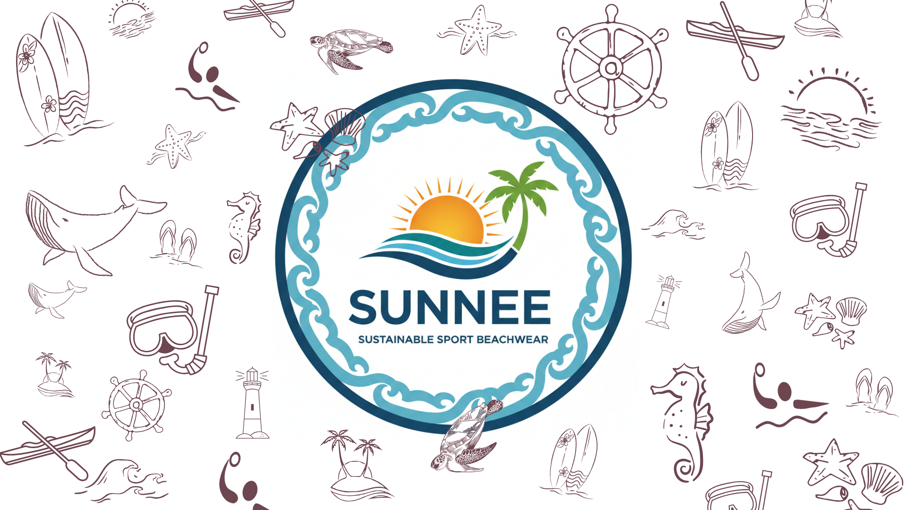

# Progetto TypeScript - SUNNEE Sustainable Beachwear



[](https://www.typescriptlang.org/)
[](https://nodejs.org/)
[](https://github.com/)
[](https://codepen.io/)

## Descrizione del progetto

Progetto TypeScript che modella la struttura operativa di Sunnee un brand di beachwear sostenibile realizzato con plastica riciclata.  
Il sistema rappresenta interazioni tra **clienti**, **prodotti** e **processi di produzione** tramite l’uso di interfacce e classi.

## Tecnologie utilizzate

- **TypeScript** per la logica del progetto e la definizione di interfacce e classi
- **Node.js** per compilare TypeScript in JavaScript
- **CodePen** per il deploy online (versione single-file)

## Funzionalità principali

- Gestione dei **prodotti** (costumi da bagno, parei, cappelli)
- Creazione di **clienti** e possibilità di ordinare prodotti
- Assegnazione di prodotti ai clienti con controllo disponibilità
- Modellazione di **processi di produzione** e aggiunta di prodotti a tali processi
- Visualizzazione in console dello stato dei prodotti e dei processi

## Istruzioni per eseguire il progetto localmente

1. Clona il repository sul tuo computer:

```bash
git clone https://github.com/PalomaFuerte/Progetto-Typescript-di-Miriam-Paloma-Fuerte-Contreras.git
```

2. Vai nella cartella del progetto.
3. Installa TypeScript se non lo hai già.

```bash
npm install -g typescript
```

4. Compila il codice TypeScript.

```bash
tsc
```

5. Esegui il progetto tramite Node.js.

```bash
node dist/index.js
```

In alternativa, puoi anche provare il progetto direttamente su CodePen (versione single-file TypeScript):
[Visualizza su CodePen](https://codepen.io/PalomaFuerte/pen/azZJoLd)

## Contatti

Puoi contattarmi attraverso i seguenti canali:
Puoi contattarmi attraverso i seguenti canali:

**Email:** lefortbyfuerte@gmail.com
**GitHub:** [Paloma Fuerte](https://github.com/PalomaFuerte)
**LinkedIn:** [Paloma Fuerte](https://www.linkedin.com/in/paloma-fuerte-073160242/)
**Instagram:** [Paloma Fuerte](https://www.instagram.com/fuertepaloma)
